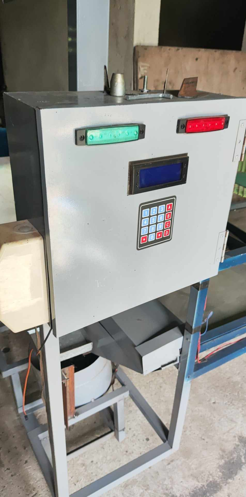

# Smart Power Monitoring and Control System (Current Limiting with GSM)

This project is an Arduino-based **smart power monitoring and control system** that measures electrical current, controls appliances using relays, and sends notifications via a GSM module. It is designed for **safety, automation, and remote monitoring** of electrical loads.

---

## Project Overview

The system integrates:

- **Current sensor** to monitor load consumption  
- **Relay modules** to control electrical devices  
- **LCD display** for real-time monitoring  
- **SIM module (GSM)** for SMS notifications  
- **Buzzer** for alerts  
- **Power supply and protection components**  

It is designed to:
- prevent overcurrent conditions  
- automatically control power  
- notify users via SMS  
- display real-time system status  

---

## Features

### ⚡ Current Monitoring
- Uses current sensor to measure AC load  
- Detects abnormal or high current  

---

### 🔌 Load Control
- Controls appliances using:
  - 2-channel relay  
  - industrial relay (5A)  
- Can automatically turn OFF loads when unsafe  

---

### 📟 LCD Display
- Displays:
  - system status  
  - current readings  
  - alerts  

---

### 📡 GSM Notification
- Sends SMS alerts using SIM module  
- Notifies user during:
  - overcurrent  
  - system fault  

---

### 🔔 Alarm System
- Buzzer activates when:
  - abnormal condition detected  
  - warning triggered  

---

### 🔄 Reset Function
- Manual reset button to restart system  

---

### 🔋 Power Management
- Uses:
  - AC to DC power supply (12V)  
  - Step-down module (to 5V)  
- Ensures stable operation  

---

## System Workflow

### 1. Power ON
- System initializes  
- LCD displays startup message  

---

### 2. Monitoring
- Current sensor continuously reads load  
- System checks if within safe limits  

---

### 3. Normal Operation
- Load remains ON  
- System displays current status  

---

### 4. Overcurrent Detected
- Relay turns OFF load  
- Buzzer activates  
- SMS alert is sent  

---

### 5. Reset
- User presses reset button  
- System restarts  

---

## Pin Configuration

### Arduino UNO

| Component            | Arduino Pin |
|---------------------|------------|
| Relay IN1           | D2         |
| Relay IN2           | D3         |
| Buzzer              | Digital Pin (configured) |
| Current Sensor OUT  | Analog Pin |
| LCD (I2C SDA)       | A4         |
| LCD (I2C SCL)       | A5         |
| Reset Button        | Digital Pin |
| SIM TX              | RX (Arduino) |
| SIM RX              | TX (Arduino) |

---

## Wiring Overview

📄 Refer to full wiring diagram:  
:contentReference[oaicite:1]{index=1}  

### 🔌 Key Connections

#### Power Supply
- AC input → Circuit breaker → Power supply (12V)  
- 12V → Step-down → 5V for Arduino  

---

#### Arduino
- Powered via 5V  
- Connected to:
  - LCD (I2C)
  - Relay module
  - Current sensor
  - GSM module  

---

#### Relay Module
- IN1 → D2  
- IN2 → D3  
- Controls AC load  

---

#### Current Sensor
- AC lines pass through sensor  
- Output → Arduino analog input  

---

#### LCD (I2C)
- SDA → A4  
- SCL → A5  

---

#### GSM Module
- TX ↔ Arduino RX  
- RX ↔ Arduino TX  
- VCC → 5V or external supply  
- GND → GND  

---

#### Buzzer
- Connected to digital output  
- GND → Ground  

---

#### Reset Button
- One side → Arduino pin  
- Other side → GND  

---

## Hardware Components

- Arduino Uno  
- Current Sensor Module  
- 2-Channel Relay Module  
- 12V Industrial Relay (5A)  
- SIM Module (GSM)  
- LCD 16x2 I2C  
- Buzzer  
- Step-down Converter  
- AC to DC Power Supply  
- Circuit Breaker  
- Potentiometer  
- Push Button  

---

## Notes

- Ensure proper isolation when working with AC voltage  
- Use circuit breaker for safety  
- GSM module may require stable external power  
- Calibrate current sensor for accurate readings  

---

## Limitations

- No mobile app interface  
- No cloud data logging  
- GSM dependent on signal availability  
- Manual reset required  

---

## Summary

This project demonstrates a **smart electrical protection system** that combines:

- current monitoring  
- relay-based control  
- GSM communication  
- real-time display  

It is suitable for:

- home electrical safety  
- industrial load monitoring  
- automation systems  
- IoT prototyping

